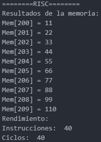
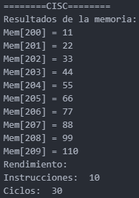

# Tarea 2 - RISC & CISC

**Curso:** CE4301 - Arquitectura de Computadores I  
**Profesor:** Jeferson Gonzalez Gomez  
**Integrante:** Jimmy Feng Feng (Carné: 2023060347)  
**Fecha:** 30 de agosto de 2025  

---

## Pregunta

1. **¿Por qué las arquitecturas RISC suelen ser más predecibles en sus tiempos de ejecución que las arquitecturas CISC? ¿En qué situaciones es importante esta predictibilidad?**

   RISC resulta más predecible porque sus instrucciones son más simples y todas tienen el mismo tiempo de ejecución. En cambio, en las arquitecturas CISC, las instrucciones son más complejas y su tiempo de ejecución puede variar según la operación.  

   Esta predictibilidad es importante en sistemas donde el tiempo de respuesta debe ser garantizado, como en aplicaciones de tiempo real, sistemas embebidos o dispositivos médicos, donde la variación en la ejecución podría comprometer la eficiencia.

---

## Desarrollo y Resultados

Se implementó un modelo de comportamiento para comparar arquitecturas RISC y CISC, aplicando una operación de suma entre dos vectores almacenados en memoria.  

Para cada arquitectura, se define previamente una memoria que contiene dos vectores de 10 elementos cada uno, además de un espacio reservado para almacenar los resultados de la suma:

### Memoria inicial

| Vector | Direcciones | Valores |
|--------|------------|--------|
| Primer vector | MEM[0] a MEM[9] | [1, 2, 3, 4, 5, 6, 7, 8, 9, 10] |
| Segundo vector | MEM[100] a MEM[109] | [10, 20, 30, 40, 50, 60, 70, 80, 90, 100] |
| Resultado esperado | MEM[200] a MEM[209] | [11, 22, 33, 44, 55, 66, 77, 88, 99, 110] |

---

### Arquitectura RISC

Se implementaron instrucciones básicas: **load**, **add** y **write**, cada una con un tiempo de ejecución de 1 ciclo por instrucción.

En la figura se observa que los resultados en **MEM[200] a MEM[209]** corresponden correctamente a la suma de los vectores.  
Como cada elemento requiere cuatro instrucciones (**load** del primer operando, **load** del segundo, **add**, y **write**), el cálculo de los 10 elementos implica un total de 40 instrucciones, ejecutadas en 40 ciclos.

---

### Arquitectura CISC

Se desarrolló una única instrucción compleja, llamada **SUMMEM**, que realiza la carga de operandos, la suma y el almacenamiento del resultado. Cada instrucción tiene un tiempo de ejecución de 3 ciclos.

En este caso, únicamente se requiere ejecutar la instrucción **SUMMEM** diez veces. Así, el total es de 10 instrucciones, que equivalen a 30 ciclos de ejecución.

---

### Conclusión

El ejercicio permitió realizar una comparación práctica entre las arquitecturas RISC y CISC. Se verificó que RISC, que tiene instrucciones sencillas y de un solo ciclo, es más fácil de predecir y necesita más instrucciones para llevar a cabo la tarea. En cambio, CISC, que cuenta con instrucciones más complicadas, puede llevar a cabo la misma tarea con menos instrucciones, aunque cada una de ellas necesita más ciclos. Esto muestra cómo el diseño de la arquitectura afecta la eficacia y la previsibilidad de la ejecución. 

---